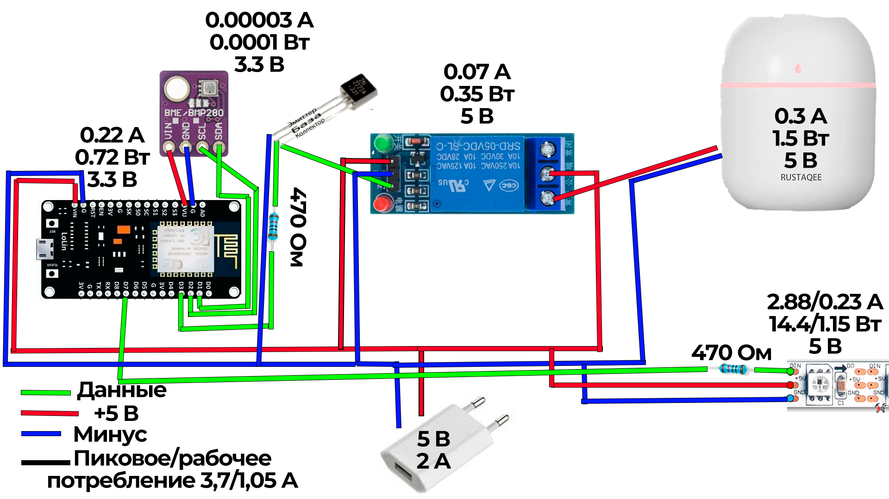

# Автоматический увлажнитель воздуха

## Описание проекта

Данный проект предназначен для автоматического увлажнения помещения с помощью ESP8266. Также он позволяет управлять светодиодной лентой и получать уведомления через Телеграм бота, при критических значениях температуры или влажности бот автоматически отправит сообщение владельцу.

## Используемые компоненты

- ESP8266 NodeMCU  
- DHT22 (датчик температуры и влажности)  
- Реле 5 В  
- Светодиодная лента 5 В  
- Увлажнитель воздуха
- Telegram Bot (через UniversalTelegramBot)  
- Блок питания 5 В 2 А

## Электропитание и потребление

| Устройство              | Ток (А) | Мощность (Вт) | Напряжение (В) |
|--------------------------|--------|---------------|---------------|
| Увлажнитель воздуха   | 0.30   | 1.50          | 5             |
| ESP8266              | 0.22   | 0.72          | 3.3           |
| DHT22                | 0.0025 | 0.0075        | 5             |
| Светодиодная лента   | 1.44   | 7.20          | 5             |
| Реле                  | 0.07   | 0.35          | 5             |

**Рекомендуемый блок питания:** не менее **5 В / 2 А** 

